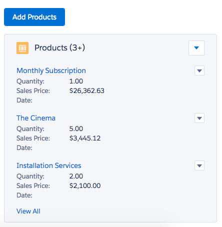
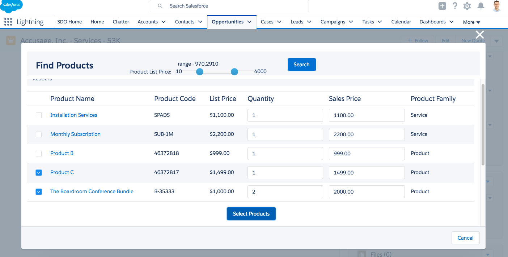
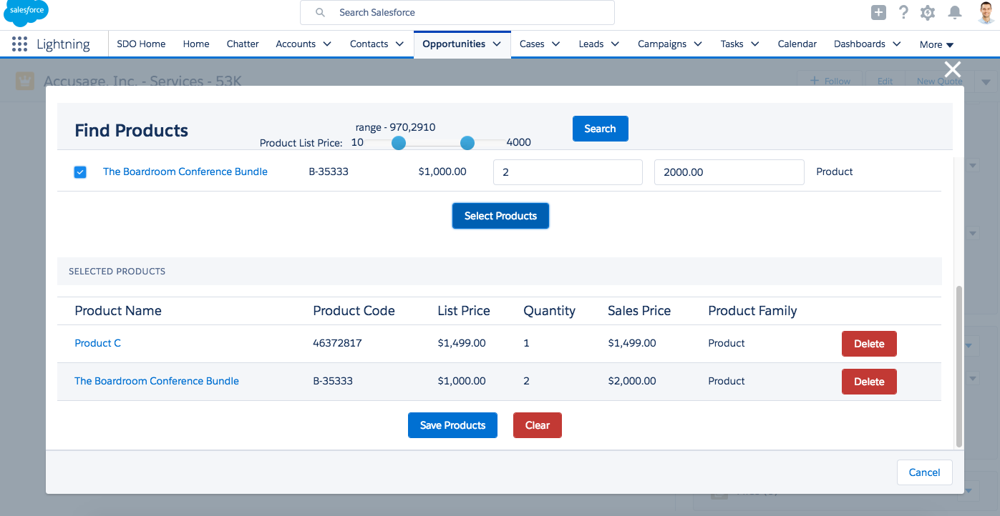

Multiple Opportunity Products LEX

This is a lightning component which enables to filter the products using a range slider based on the List Price of the product and to add multiple selected products to the opportunity.

Detailed Description
When you drag the "FilterOppProducts" component on the opportunity detail page in LEX you'll find a "Add Products" button which on clicked opens a modal pop up. All the products can be searched or products can be filtered using the range slider based on the List Price of the product. The result will display a list of products which can be selected and only the selected products will be added to the opportunity on clicking save.

Setup Instructions

1. Install the package.

2. Drag the "FilterOppProducts" on the opportunity detail page.

3. Click on "Add Product" button to open the pop up and add the selected products to the opportunity.